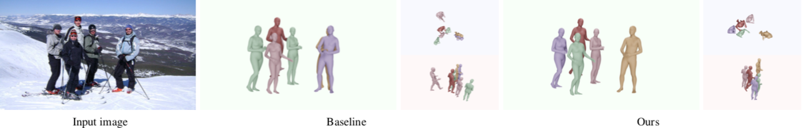

# Coherent Reconstruction of Multiple Humans from a Single Image 
Code repository for the paper:  
**Coherent Reconstruction of Multiple Humans from a Single Image**  
[Wen Jiang](https://jiangwenpl.github.io/)\*, [Nikos Kolotouros](https://www.seas.upenn.edu/~nkolot/)\*, [Georgios Pavlakos](https://www.seas.upenn.edu/~pavlakos/), [Xiaowei Zhou](http://www.cad.zju.edu.cn/home/xzhou/), [Kostas Daniilidis](http://www.cis.upenn.edu/~kostas/)  
CVPR 2020
[[paper](https://arxiv.org/pdf/2006.08586.pdf)] [[project page](https://jiangwenpl.github.io/multiperson/)]



## Contents

Our repository includes training/testing/demo code for our paper. Additionally, you might find useful some parts of the code that can also be used in a standalone manner. More specifically:

[Neural Mesh Renderer](./neural_renderer):
Fast implementation of the original [NMR](https://hiroharu-kato.com/projects_en/neural_renderer.html).

[SDF](./sdf):
CUDA implementation of the SDF computation and our SDF-based collision loss.

[SMPLify 3D fitting](./misc/smplify-x):
Extension of [SMPLify](http://files.is.tue.mpg.de/black/papers/BogoECCV2016.pdf) that offers the functionality of fitting the SMPL model to 3D keypoints.

## Installation instructions
This codebase was adopted from early version of mmdetection and mmcv. Users of this repo are highly recommended to
read the readme of [mmcv](./mmcv/README.rst) and [mmdetection](./mmdetection/README.md) before using this code.

To install mmcv and mmdetection:
```bash
conda env create -f environment.yml
cd neural_renderer/
python3 setup.py install
cd ../mmcv
python3 setup.py install
cd ../mmdetection
./compile.sh
python setup.py develop
cd ../sdf
python3 setup.py install
```

## Fetch data
Download [our model data](https://drive.google.com/file/d/1y5aKzW9WL42wTfQnv-JJ0YSIgsdb_mJn/view?usp=sharing) and place them under `mmdetection/data`.
This includes the model checkpoint and joint regressors.
You also need to download the mean SMPL parameters from [here](https://people.eecs.berkeley.edu/~kanazawa/cachedir/hmr/neutral_smpl_mean_params.h5).
Besides these files, you also need to download the SMPL model. You will need the [neutral model](http://smplify.is.tue.mpg.de) for training, evaluation and running the demo code.
Please go to the websites for the corresponding projects and register to get access to the downloads section. In case you need to convert the models to be compatible with python3, please follow the instructions [here](https://github.com/vchoutas/smplx/tree/master/tools).

After finishing with the installation and downloading the necessary data, you can continue with running the demo/evaluation/training code.

## Run demo code

We provide code to evaluate our pretrained model on a folder of images by running:

```bash
cd mmdetection
python3 tools/demo.py --config=configs/smpl/tune.py --image_folder=demo_images/ --output_folder=results/ --ckpt data/checkpoint.pt
```

## Prepare datasets
Please refer to [DATASETS.md](./DATASETS.md) for the preparation of the dataset files.

## Run evaluation code
Besides the demo code, we also provide code to evaluate our models on the datasets we employ for our quantitative evaluation. Before continuing, please make sure that you follow the [preparation of test sets](DATASETS.md).

You could use either our pretrained checkpoint or the model trained by yourself to evaluate on Panoptic, MuPoTS-3D, Human3.6M and PoseTrack.

Example usage:
```
cd mmdetection
python3 tools/full_eval.py configs/smpl/tune.py full_h36m --ckpt ./work_dirs/tune/latest.pth
```

Running the above command will compute the MPJPE and Reconstruction Error on the Human3.6M dataset (Protocol I). 
The ```full_h36m``` option can be replaced with other dataset or sequences based on the type of evaluation you want to perform:
- `haggling`: haggling sequence of Panoptic
- `mafia`: mafia sequence of Panoptic
- `ultimatum`: ultimatum sequence of Panoptic
- `haggling`: haggling sequence of Panoptic
- `mupots`: MuPoTS-3D dataset
- `posetrack`: PoseTrack dataset

Regarding the evaluation:
- For Panoptic, the command will compute the MPJPE for each sequence.
- For MuPoTS-3D, the command will save the results to the `work_dirs/tune/mupots.mat` which can be taken as input for official MuPoTS-3D test script.
- For H36M, the command will compute P1 and P2 for test set.

## Run training code

Please make sure you have prepared all [datasets](./DATASETS.md) before running our training script.
The training of our model would take three phases, pretrain -> baseline -> fine tuning. We prepared three configuration 
files under `mmdetection/configs/smpl/`.
To train our model from scratch:

```bash
cd mmdetection
# Phase 1: pretraining
python3 tools/train.py configs/smpl/pretrain.py --create_dummy
while true:
do
    python3 tools/train.py configs/smpl/pretrain.py
done
# We could move to next phase after training for 240k iterations

# Phase 2: baseline
python3 tools/train.py configs/smpl/baseline.py --load_pretrain ./work_dirs/pretrain/latest.pth
while true:
do
    python3 tools/train.py configs/smpl/baseline.py 
done
# We could move to next phase after training for 180k iterations

# Phase 3: Fine-tuning
python3 tools/train.py configs/smpl/tune.py --load_pretrain ./work_dirs/baseline/latest.pth
while true:
do
    python3 tools/train.py configs/smpl/tune.py 
done
# It could be done after 100k iterations of training
```

All the checkpoints, evaluation results and logs would be saved to `./mmdetection/work_dirs/` + `pretrain|baseline|tune` respectively.
Our training program will save the checkpoints and restart every 50 mins. You could change the `time_limit` in the
configurations files to something more convenient

## Citing
If you find this code useful for your research or the use data generated by our method, please consider citing the following paper:

	@Inproceedings{jiang2020mpshape,
	  Title          = {Coherent Reconstruction of Multiple Humans from a Single Image},
	  Author         = {Jiang, Wen and Kolotouros, Nikos and Pavlakos, Georgios and Zhou, Xiaowei and Daniilidis, Kostas},
	  Booktitle      = {CVPR},
	  Year           = {2020}
	}

## Acknowledgements

This code uses ([mmcv](https://github.com/open-mmlab/mmcv) and [mmdetection](https://github.com/open-mmlab/mmdetection)) as backbone.
We gratefully appreciate the impact these libraries had on our work. If you use our code, please consider citing the [original paper](https://arxiv.org/abs/1906.07155) as well.
